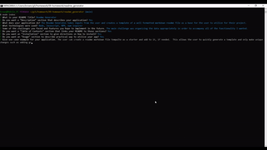
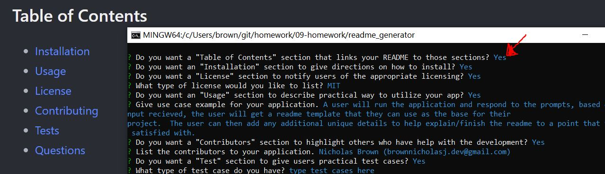
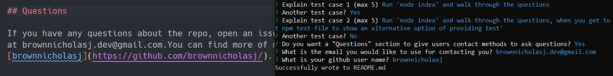

# Readme Generator Application


## Description

- The application will take user input and generate a professional looking
  readme.md file.
- node, javascript, npm, npm inquirer
- The biggest challenge I had was organizing the data in a method that I could
  get all of the functionality I wanted in the app.

## Table of Contents

- [Installation](#installation)
- [Usage](#usage)
- [License](#license)
- [Contributing](#contributing)
- [Tests](#tests)
- [Questions](#questions)

## Installation

To install necessary dependencies, run the following command:

```
npm i
```

The following dependencies will be installed:

- inquirer

## Usage

A user will run the application and respond to the prompts, based on the input
recieved, the user will get a readme template that they can use as the base for
their project. The user can then add any additional unique details to help
explain/finish the readme to a point that they are satisfied with.

## License

This project is licensed under the MIT license.

## Contributing

A thanks to the following contributors to this project: Nicholas Brown
(brownnicholasj.dev@gmail.com)

## Test

- Run 'node index' and walk through the questions answering as desired
- Run 'node index' and walk through the questions, when you get to the 'Test'
  section, select npm test file to show an alternative option of providing test'
- Run 'node index' and give the README a title, then select 'No' on all next
  sections, README will print out with a title and no other sections
- Run 'node index' and ensure you select 'Yes' for the license section. The 9
  most common license options according to
  (https://github.blog/2015-03-09-open-source-license-usage-on-github-com/)
- Run 'node index' and on the final section 'questions', put in an active github
  profile name in the github question - the link will be populated in the
  readme.

## Demo

https://youtu.be/R5AoJgEOQ40



- The program will ask a series of command line questions to the user utilizing
  'npm inquirer'
- The inquirer module is used in a way to ask 'confirm' questions to input a
  section or not, based on that feedback the program will ask additional
  questions (dependant on the section).
  - Ex. the License section is a 'Yes'/'No' confirm question. If Yes, the
    program will give the user a list of most used licenses to choose from
  - Ex. the Description section is a 'Yes'/'No' confirm question. If yes, the
    program will ask additional questions to get details for that section.
- When the sections are confirmed, the 'Table of Contents' section will create
  the sections chosen within the TOC section with links to those sections in the
  README

The input from the user for the title is reflected in the README Title


The input from the user for the description is reflected within that section


The input/confirmation of having a table of contents section, will create a TOC
with all selected sections 

The input for the installation, usage, license, and contribution sections are
all respected and displayed based on user selection and input


The input of the questions section will apply the github user name to the github
link and allow users to click on the link to go to the page


## Questions

If you have any questions about the repo, open an issue or contact me directly
at brownnicholasj.dev@gmail.com.You can find more of my work at
[brownnicholasj](https://github.com/brownnicholasj/).
