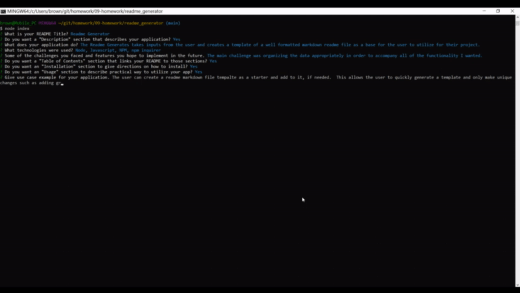

# Readme Generator


## Description

- The Readme Generates takes inputs from the user and creates a template of a
  well formatted markdown readme file as a base for the user to utilize for
  their project.
- Node, Javascript, NPM, npm inquirer
- The main challenge was organizing the data appropriately in order to accompany
  all of the functionality I wanted.

## Table of Contents

- [Installation](#installation)
- [Usage](#usage)
- [License](#license)
- [Questions](#questions)

## Installation

To install necessary dependencies, run the following command:

```
npm i
```

The following dependencies will be installed:

- inquirer

## Usage

The user can create a readme markdown file template as a starter and add to it,
if needed. This allows the user to quickly generate a template and only make
unique changes such as adding graphics or examples.

## Demo

https://youtu.be/2oVNNmsrCTg



- The program will ask a series of command line questions to the user utilizing
  'npm inquirer'
- The inquirer module is used in a way to ask 'confirm' questions to input a
  section or not, based on that feedback the program will ask additional
  questions (dependant on the section).
  - Ex. the License section is a 'Yes'/'No' confirm question. If Yes, the
    program will find the license object in the 'package.json' file
  - Ex. the Description section is a 'Yes'/'No' confirm question. If yes, the
    program will ask additional questions to get details for that section.

## License

This project is licensed under the MIT license.

## Questions

If you have any questions about the repo, open an issue or contact me directly
at brownnicholasj.dev@gmail.com.You can find more of my work at
[brownnicholasj](https://github.com/brownnicholasj/).
